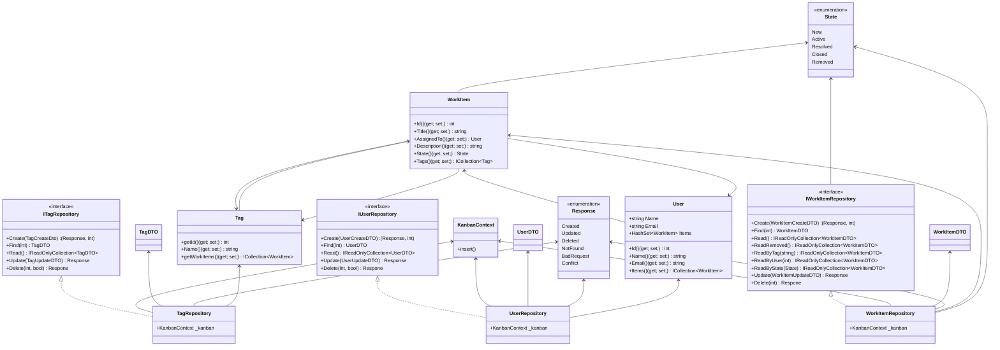
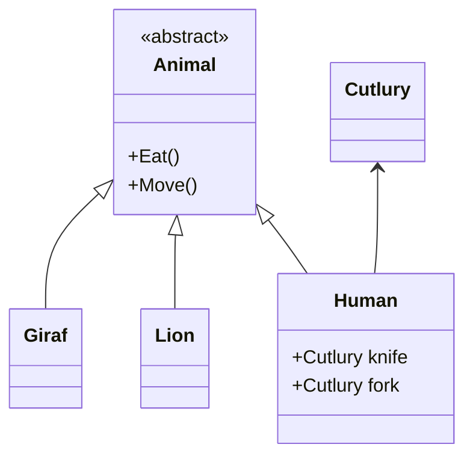
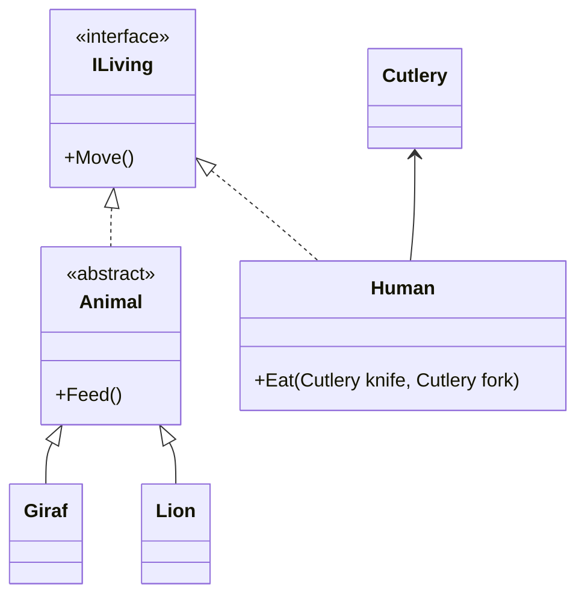

# assignment-04

## Infrastructure diagram

```mermaid
classDiagram
ITagRepository <|.. TagRepository
IWorkItemRepository <|.. WorkItemRepository
IUserRepository <|.. UserRepository
WorkItem --> Tag
WorkItem <-- User
WorkItem <-- Tag
User <-- WorkItem
Tag <-- WorkItem
State <-- WorkItem
KanbanContext <-- TagRepository
TagDTO <-- TagRepository
Response <-- TagRepository
Tag <-- TagRepository
KanbanContext <-- UserRepository
UserDTO <-- UserRepository
Response <-- UserRepository
User <-- UserRepository
KanbanContext <-- WorkItemRepository
WorkItemDTO <-- WorkItemRepository
Response <-- WorkItemRepository
WorkItem <-- WorkItemRepository
State <-- IWorkItemRepository
State <-- WorkItemRepository


class KanbanContext {
    +insert()
}
class Tag {
    +getId() (get; set;) int 
    +Name() (get; set;) string
    +getWorkItems()  (get; set;) ICollection~WorkItem~ 
}
class TagRepository {
    +KanbanContext _kanban
}
class ITagRepository {
    <<interface>>
    +Create(TagCreateDto) : (Response, int)
    +Find(int) TagDTO
    +Read() IReadOnlyCollection~TagDTO~
    +Update(TagUpdateDTO) Response
    +Delete(int, bool) Respone
}
class TagDTO {
    
}
class User {
    +string Name
    +string Email
    +HashSet~WorkItem~ Items
    +Id()  (get; set;) int
    +Name()  (get; set;) string
    +Email()  (get; set;) string
    +Items()  (get; set;) ICollection~WorkItem~
}
class UserRepository {
    +KanbanContext _kanban
}
class IUserRepository {
    <<interface>>
    +Create(UserCreateDTO) : (Response, int)
    +Find(int) UserDTO
    +Read() IReadOnlyCollection~UserDTO~
    +Update(UserUpdateDTO) Response
    +Delete(int, bool) Respone
}
class UserDTO {
    
}
class WorkItem {
    +Id() (get; set;) int
    +Title() (get; set;) string
    +AssignedTo() (get; set;) User
    +Description() (get; set;) string
    +State() (get; set;) State
    +Tags() (get; set;) ICollection~Tag~
}
class WorkItemRepository {
    +KanbanContext _kanban
}
class IWorkItemRepository {
    <<interface>>
    +Create(WorkItemCreateDTO) : (Response, int)
    +Find(int) WorkItemDTO
    +Read() IReadOnlyCollection~WorkItemDTO~
    +ReadRemoved() IReadOnlyCollection~WorkItemDTO~
    +ReadByTag(string) IReadOnlyCollection~WorkItemDTO~
    +ReadByUser(int) IReadOnlyCollection~WorkItemDTO~
    +ReadByState(State) IReadOnlyCollection~WorkItemDTO~
    +Update(WorkItemUpdateDTO) Response
    +Delete(int) Respone
}
class WorkItemDTO{
    
}
class Response{
    <<enumeration>>
    Created
    Updated
    Deleted
    NotFound
    BadRequest
    Conflict
}
class State{
    <<enumeration>>
    New
    Active
    Resolved
    Closed
    Removed
}
```

## Excercise 4

```mermaid
classDiagram
Animal <|-- Giraf
Animal <|-- Lion
Animal <|-- Human
Cutlury <-- Human
class Animal{
    <<abstract>>
    +Eat()
    +Move()
}
class Giraf{
    
}
class Lion{
    
}
class Human{
    +Cutlury knife
    +Cutlury fork
}
```

## Excercise 5

```mermaid
classDiagram
ILiving <|.. Animal
ILiving <|.. Human
Animal <|-- Giraf
Animal <|-- Lion
Cutlery <-- Human
class ILiving{
    <<interface>>
    +Move()
    
}
class Animal{
    <<abstract>>
    +Feed()
}
class Giraf{
    
}
class Lion{
    
}
class Human{
    +Eat(Cutlery knife, Cutlery fork)
}


```